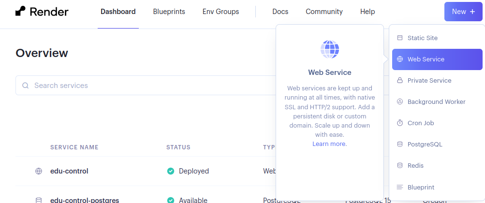
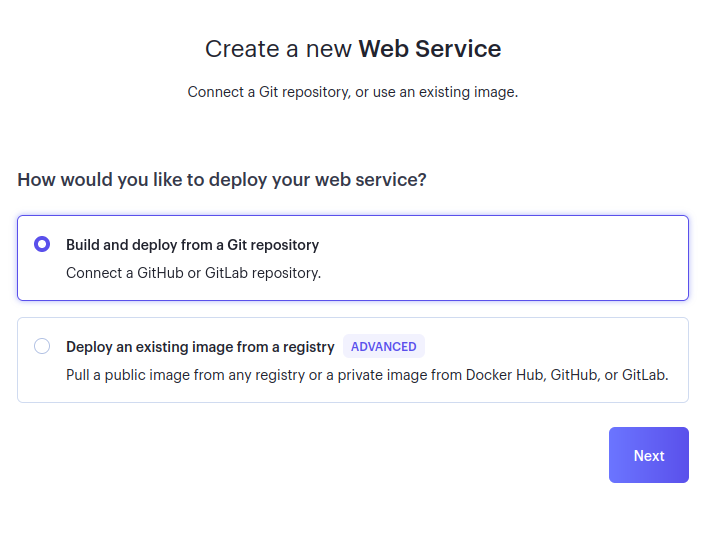
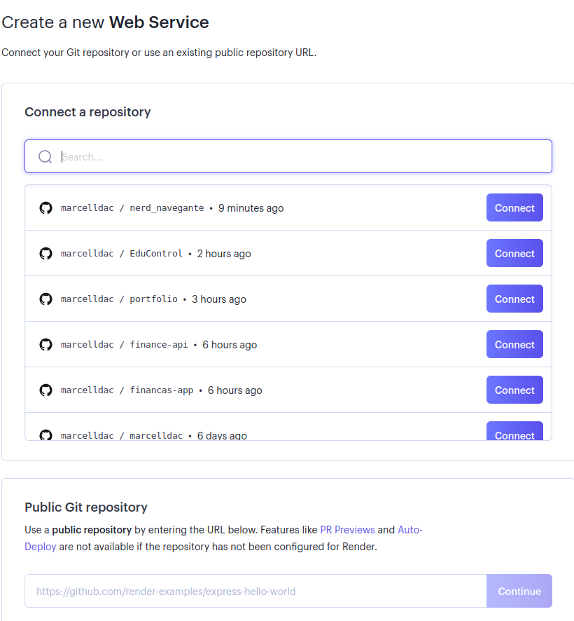
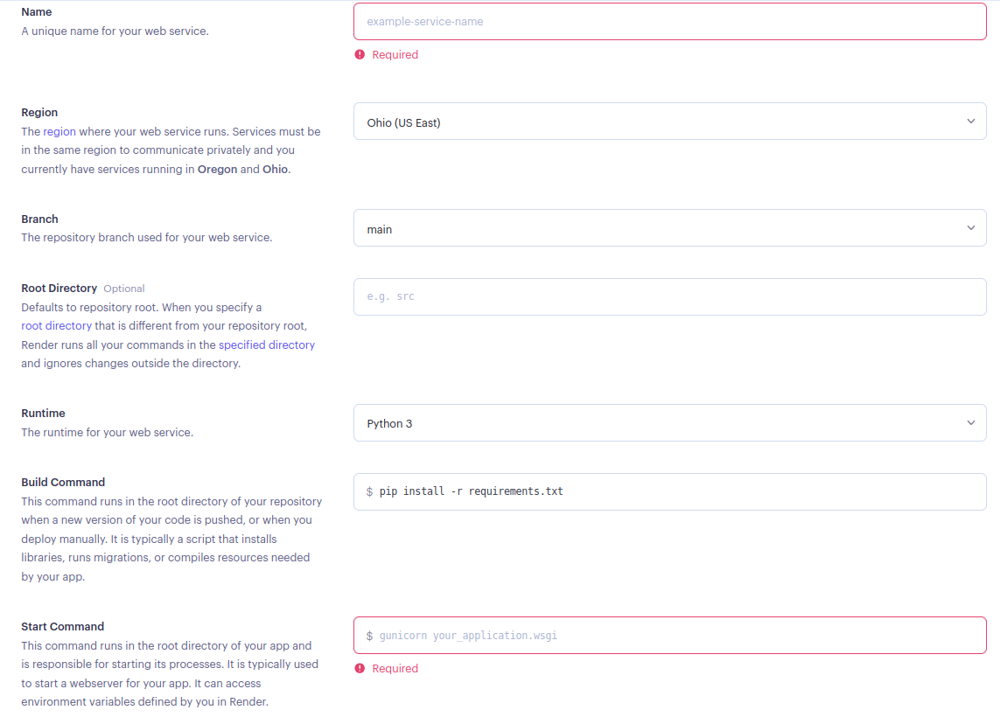

## como dar deploy em uma api

olá. indo direto ao ponto, vamos precisar seguir os seguintes passos

### crie uma conta no [render.com](https://render.com/)

### no canto superior direito clique em **new** >> **web service**



### selecione a conexão com github



### escolha um repositório seu ou qualquer repositório público do github



### com o repositório escolhido, esolha um nome para o projeto, comando de build e de start.

caso a aplicação seja em nodejs

para buildar

```bash
npm run build
```

para rodar

```bash
npm run dev || npm start
```

(lembre-se que estes comandos devem ser pré-configurados no **package.json**)



### ao fim de tudo, clique em create web service


