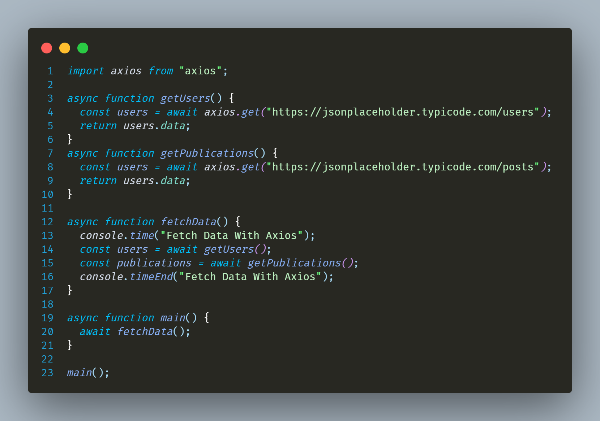
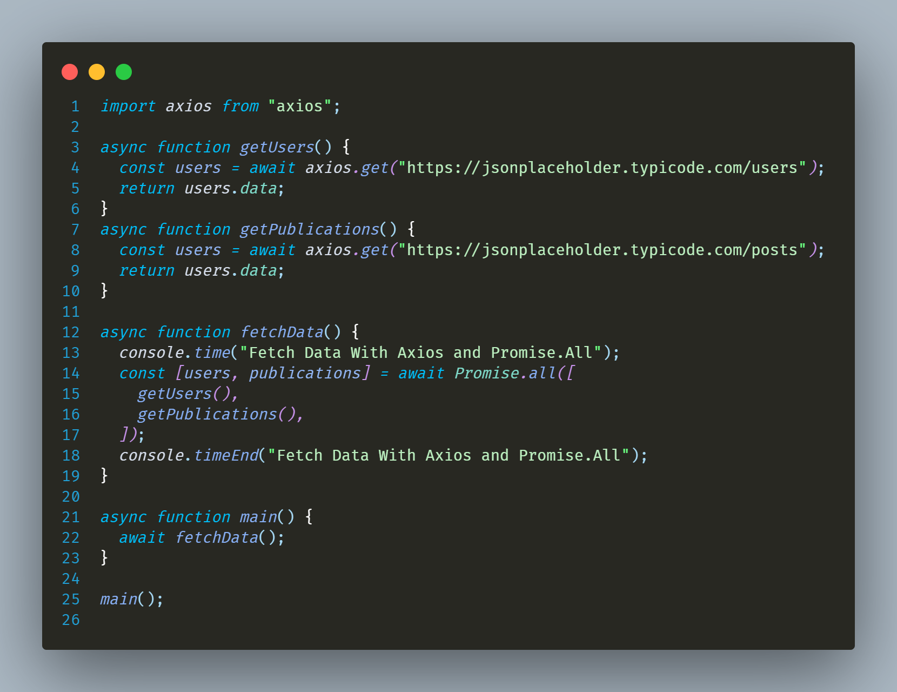

# Melhorando performance nas chamadas API em aplicações Node



Fiz testes reais em um cenário onde não utilizamos o ```Promise.All``` e obtive os seguintes números:

- 669.065ms
- 651.111ms
- 732.241ms

em média obtemos __684.139ms__ para duas requisições. Sendo assim, __342.0695ms__ por requisição (em um cenário onde as duas levarão o mesmo tempo para executar)



Da forma a seguir estamos utilizando o Promise.All do Javascript.
Os testes deste lado obtiveram os seguintes valores:

- 537.064ms
- 521.825ms
- 538.736ms

em média, __532.541ms__ para as duas e __266.270ms__ para uma requisição. Basicamente o promise.all recebe um array de promises e retorna uma promise ao final de todas as promises escritas. Como é retornada uma promise, também podemos utilizar o ```.then``` e/ou ```.catch()```.